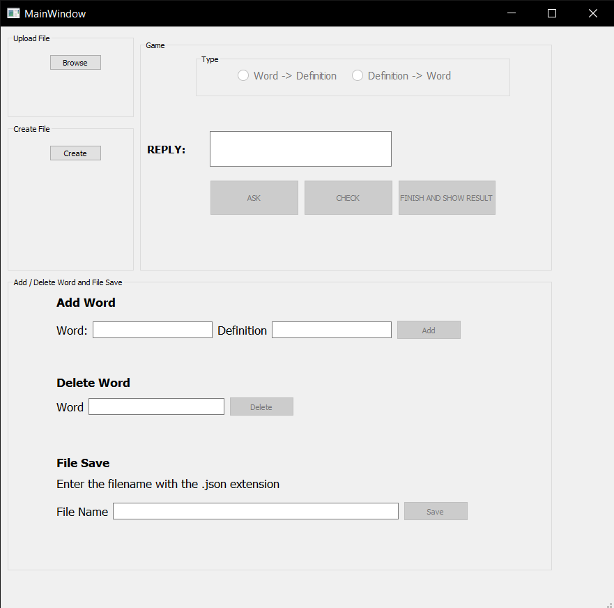

# Flashcard Desktop Application

### Flashcard desktop application that can be used to make word memorization.

Application design was made with Pyqt5-tools Designer.

To use the application, instead of running the codes every time, you can convert it to an exe file and use it as a desktop application.If you do not know how to do this, you can reach detailed and illustrated explanation [here.](https://www.geeksforgeeks.org/convert-python-script-to-exe-file/)

You can watch a short demonstration of how the application works [here.](https://www.linkedin.com/feed/update/urn:li:activity:6693141751688921088/)

