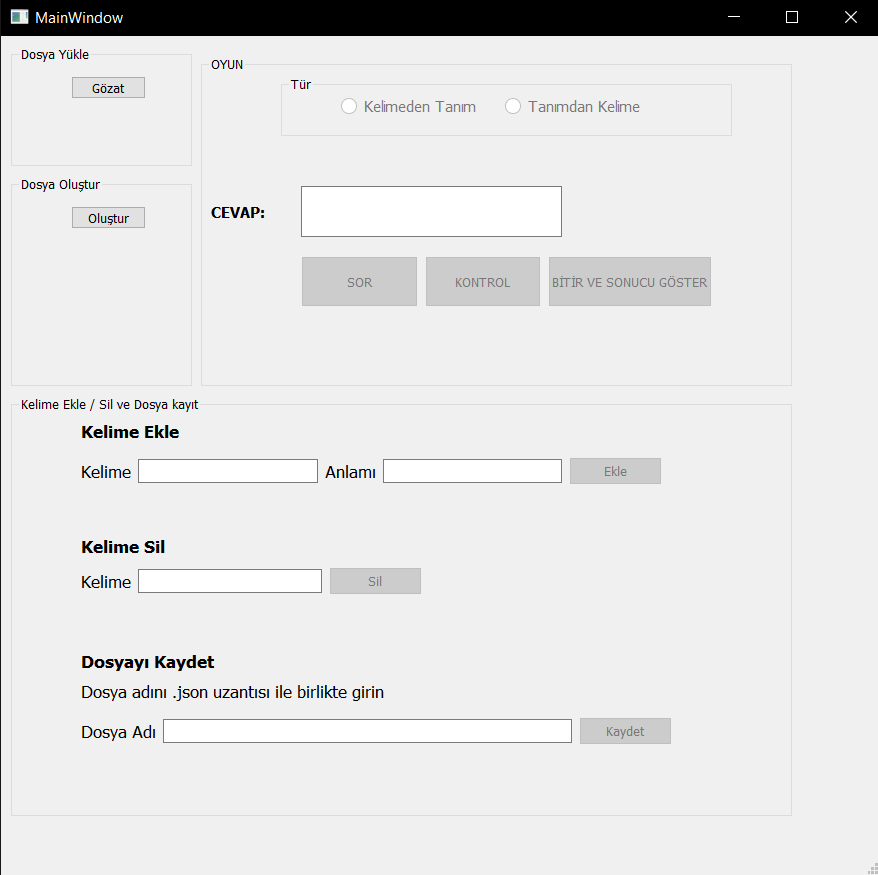

# Kelime Karti/Flashcard Masaüstü Uygulaması

#### Kelime ezberi yapmak için kullanılabilecek kelime kartı/flashcard masaüstü uygulaması

Uygulama tasarımı Pyqt5-tools Designer ile yapılmıştır. 

Uygulamayı çalıştırmak için her seferinde kodları çalıştırmak yerine exe dosyasına çevirip tam olarak masaüstü uygulaması olarak kullanabilirsiniz. Bunun için önce pyinstall kütüphanesini indirmeniz daha sonra uygualama dosyalarının olduğu dizinde terminal açmanız ve pyinstaller --onefile -w main.py kodunu çalıştırmanız gerekmektedir. Detaylı ve resimli anlatıma [buradan](https://www.geeksforgeeks.org/convert-python-script-to-exe-file/) ulaşabilirsiniz.

Uygulamanın nasıl çalıştığının kısa bir gösterimini [şu adresteki](https://www.linkedin.com/feed/update/urn:li:activity:6693141751688921088/) videodan izleyebilirsiniz

